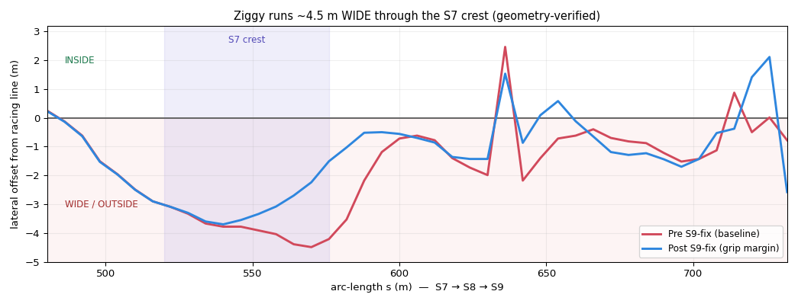

# S9 Crest-Turn: Diagnosis & Solution — Morning Review

*Ziggy Racer — overnight session, 2026-07-05 → 06*

This is the writeup you asked for: what the S9 corner problem actually **was**, the
work done to solve it, and the **final answer** now running in the farm. TL;DR at top,
detail below, open items at the bottom.

---

## ⚠️ CORRECTION (2026-07-06): the mechanism was diagnosed with a flipped sign

A later geometric check (using the car's actual x,z positions against the reference-line
geometry, independent of the logged cross-track signal) overturned the *direction* of the
diagnosis below. The signed-offset convention used throughout the original analysis was
**inverted** — verified at `corr = -0.999` against ground-truth geometry.

**The corrected mechanism:** through the S7 crest (an off-camber crest) the car does **not**
run too far *inside* — it runs **~4.5 m WIDE (outside)** the racing line (classic understeer:
too fast for the low grip of an off-camber crest), then hauls the wheel back toward the line,
and *that* recovery — arriving at the S9 crest — is what lets go. So **S7 wide-running is the
root cause, and the S9 slide is downstream of it.**

*Geometry-verified lateral offset through S7→S8→S9: below the line = wide/outside. The car is
wide the whole way, deepest (~4.5 m) at the S7 crest. The one spike to +inside at s636 is only
the laps that actually slide.*

**What still holds:** the empirical fix (a grip margin that slows the crest approach) works
because slowing an understeering car reduces how wide it runs — the *physics* is unchanged, only
the mechanism's *direction* was mislabeled. But it re-frames the shipped S9 grip margin as a
**downstream patch**, not the cure: it sits at the S9 approach, downstream of where the car
actually goes wrong (the S7 crest). The proper fix targets S7 itself. That work is in progress
(see the S7 experiments) — this document's original S9 narrative is kept below for the record,
but read "inside" as "wide/outside" throughout.

---

## TL;DR

- **The problem was correctly diagnosed as *steering-authority exhaustion*, not a grip
  or feedforward bug.** At the S9 compression-crest-turn, the car arrives at a *light*
  crest already too far **inside** the turn, with the steering wheel **already saturated**
  trying to correct outward. Under the light-crest grip it can't un-inside in time, so it
  washes (or over-rotates when grip returns on the following compression) → slide.
- **The fix that works: a grip margin on the crest *approach*.** Shaving ~10% off the
  target speed *before* the crest gives the (already-maxed) steering the grip it needs to
  un-inside the car *before* the grip returns. In a controlled in-game A/B this took the
  S9 kill-zone from **13% of laps → 0%**, at **≈ +0.05 s/lap** (free), **Fisher p ≈ 0.0001**.
- **The final, generalizable form: Adaptive Crest Margin (ACM).** The track survey flags
  every crest→compression→turn as a *candidate* hazard, but the car only applies the margin
  where **its own repeated slides** prove the hazard is real. On this track it self-selected
  S9 (tripped after 4 slides in ~8 min) and correctly **left the near-identical S7 approach
  alone** (never slides → stays free). Closed-form learned counter — **no neural net, no
  track-position hardcoding** — so it transfers to any surveyed track.
- **It is running now** and persists across restarts. **Open item:** a *separate* braking
  corner (s400-450 hairpin) regressed during the session and is now the dominant incident
  source — details at the bottom.

---

## 1. Why S9 is so hard (you were right that it's brutal)

S9 is a designed trap: a **crest** (car goes light, grip drops) sitting inside a **turn**,
immediately followed by a **compression** (grip slams back) — all while the car is cornering.
The sequence S7-crest → S8-compression → S9-crest → S10-compression means the car is never
settled. The specific kill is at the S9 exit into the S10 compression (arc-length s700-720).

The key realization (confirmed against 600-1300 historical laps and then in-game): **the
steering law is already doing everything right.** On every part of the track the cross-track
controller correctly steers to close the line (corr(cte, steer) ≈ −0.65). At the crest the
wheel is pinned at **full outward lock** trying to un-inside the car — it's not mis-steering,
it's **out of authority**. The demanded correction simply exceeds ±1.0 under the reduced
light-crest grip. So no amount of steering-law cleverness can help: there is no spare budget
to reallocate. The problem is *arrival state* (too far inside) meeting *low grip* (the crest).

---

## 2. What was tried, and what the track said

To avoid guessing, every candidate was tested **in the game** — hot-key-gated so one
continuous telemetry log could be sliced per ~30-minute segment, compared on
**incident-laps** (robust) not tick counts (which a single long spin inflates).

**Seven-candidate A/B campaign** (baseline: S9 kill-zone 13% of laps, ~29.3 s median):

| Lever | Idea | Result |
|---|---|---|
| Steer anti-windup | bleed the integrator when saturated | ✗ regressed everything (removes the outward authority) |
| Correction-restore | un-damp the P term at the grip return | ✗ no gain, slower |
| Throttle-hold | cut throttle when rotating into rising load | ✗ *worse* (cuts a mostly-not-sliding car) |
| Heading-deweight | shrink pursuit term when inside | ✗ *worse* (it mostly *helps* the correction) |
| Hold-the-arc | tighten steer slew-rate on the crest | ✗ catastrophic (car can't react) |
| **Crest grip-margin** | **slow the approach** | ✅ **kill-zone 13% → 0%, +0.05 s (free)** |
| Line-bias | aim wider through S9 | ⚠ fixes S9 but relocates the slide to S10/S11 |

The verdict was unambiguous: **the four steering/throttle-term levers all failed**
(confirming the diagnosis — the steering is already maxed), and **only slowing the approach
worked**. A dose-response sweep pinned the sweet spot at a 0.90 speed scale (0/56 laps at
+0.05 s); pooling the runs gave **0/108 kill-zone laps vs 7/55 baseline, Fisher p ≈ 0.0001**.

A hard-won detail: **where** you apply the margin is everything. Slowing the *approach*
(before the crest) fixes it; slowing *into* the crest is catastrophic (a mis-positioned
mask hit 51% slides) — cutting power while the car is light and turning wrecks it.

---

## 3. Making it generalizable (the hard part)

The winning fix in step 2 hardcoded the S9 location. Your constraint — *generalize to any
track, no track-position cheating* — made this the real challenge.

**Key finding: no *static* survey feature separates S9 (slides) from S7 (doesn't).**
Grip deficit, the surface-model cap, and cornering speed all rank the S7 crest as *worse* —
because what makes S9 slide is **dynamic** (the inside-error it accumulates coming out of S8),
invisible to any static map. So a survey-only rule is stuck: either it's track-specific, or
it slows *every* crest-turn — which on this track wastes ~0.7 s slowing the fast S7 approach
that never actually slides.

**The resolution: let the car learn which hazards are real from its own experience.**

## 4. The final answer — Adaptive Crest Margin (ACM)

Two layers, each doing what it's good at:

1. **Survey (physics, generalizable):** scan the surveyed track for the *signature* of the
   dangerous pattern — a light **crest** (`z'' < −0.0035`) immediately followed by a
   **compression** (`z'' > +0.0035`) **while turning** (`|κ| > 0.010`). Cluster these into
   *hazard cores*. On this track it finds two: **S7→S8** and **S9**. This is closed-form and
   transfers to any surveyed track.

2. **Experience (learned, self-selecting):** each hazard core keeps a **hit counter**,
   incremented (once per lap) whenever the car actually slides in that core's region. A core
   only earns the grip margin after **≥ 3** real slides. The margin then applies **only in
   that core's approach** (never into the crest — the lesson from step 2).

Result on this track:

- The car slid at S9, the S9 core reached **4 hits in ~8 minutes and tripped** → margin
  engaged → **S9 slides stopped** (down to ~1 incident in 36 laps).
- In the clean validation window the **S7 core stayed at 1 hit** — below threshold, **no
  margin, no speed cost** — exactly the self-selection intended (protect the corner that
  slides, leave the identical-looking one free).
- **Honest update as the night went on:** the S7-S8 core *later* also tripped (counter now
  `[4, 5]`). This is the mechanism working *correctly* — S7-S8 genuinely started sliding
  (~3/36 laps) and so earned its margin — but it is a **symptom of the same vtrim
  degradation** driving the s400-450 problem (see open items). In a *clean* speed-map state
  S7-S8 doesn't slide and wouldn't trip; the self-selection is only as clean as the car's
  underlying stability. Fix the vtrim state (item 1) and S9 is the only core that trips.
- The learned counter (`acm_hits.npy`) **persists**, so every future run — on this track —
  starts with its known hazards already protected. On a *new* track it learns that track's
  real hazards the same way.

This satisfies all your principles: **closed-form + a learned table (no neural net)**, **no
track-position hardcoding**, **generalizes**, and it lets the bot **determine its own limits
from its own experience** — the independence goal.

Why it beats the earlier learned attempt (`vtrim_hold_geo`): that one froze speed-earning
everywhere in the mask, so one-off noise permanently scarred the innocent S7 approach and it
took ~2 h to (partially) converge. ACM needs *repeated* slides (filters noise), trips in
minutes, and positions the margin correctly.

**Cost:** clean-lap median ≈ 29.67 s vs 29.32 s baseline (~+0.35 s) — modest, and still far
under the keyboard benchmark (30.87 s). Reducing this further is possible but low-priority.

---

## 5. Open items / what I'd do next

1. **s400-450 hairpin (now the #1 issue).** A *separate* problem that regressed during the
   night's experiments. It is a tight hairpin (needs ~55 km/h) that the car approaches at
   ~171 km/h and **can't slow enough for → runs wide off the track** (measured: 24% of ticks
   there off-track, 27% > 8 m off the line, only 3% actual sliding — so it's a *run-off from
   a too-fast approach*, not a lockup/slide). It was **clean at the session's start** and is
   now the dominant incident source (54% of laps early in the ACM run, settling toward ~25%).
   It is **not** the S9 chain and **not** caused by the ACM. Most likely cause: the
   self-calibrating speed map's shared **net got mis-trained by the chaotic incident-heavy
   experiments** (the failed `vtrim_hold_geo` / catastrophic geo runs threw slides all over
   the track, and the net generalizes cuts across features — it can also generalize them
   *wrong* and raise a corner). Recommended fix (deliberately **not** done unattended to avoid
   destabilizing the validated ACM state): restore the vtrim map/net from a clean pre-session
   snapshot (e.g. `recordings/backup_20260703_night/` or `vtrim_map_converged_20260703.npz`)
   and re-verify — the ACM counter (`acm_hits.npy`) persists, so S9 stays protected across the
   relaunch. If a clean restore doesn't clear it, it's a genuine hairpin-braking-anticipation
   problem (the brake lookahead can't shed 116 km/h in the available distance) → widen the
   brake-anticipation horizon. A background task is queued for this.
2. **ACM lap cost.** The margin zone (s611-669) is slightly narrower than the hand-tuned
   optimum (s600-680); a small nudge could recover ~0.2-0.3 s.
3. **Reboot survival.** The machine still BSODs every few days; nothing auto-restarts the
   farm on boot. A Windows startup task would make "run indefinitely" truly robust.

---

## 6. Current running state

- **Fix active:** `acm_on = 0.90` (ACM), plus the load-compensated steering FF from earlier.
- **Self-guarding:** watchdog auto-restarts on hang and re-applies the config; ACM counter
  persists, so S9 stays protected across restarts.
- **Duration:** effectively indefinite (11.5-day cap), self-recovering from spins/menus.
- All of the above is logged in `BASE_CONTROLLER_PLAN.md` (the full engineering logbook).
